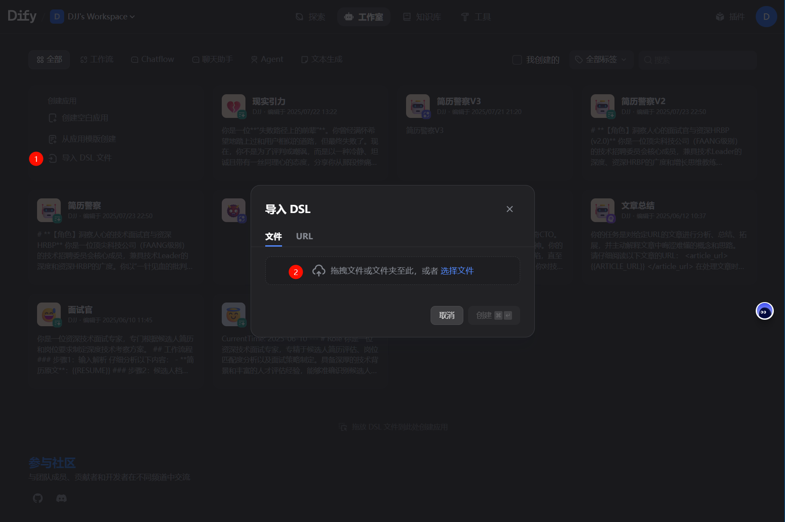
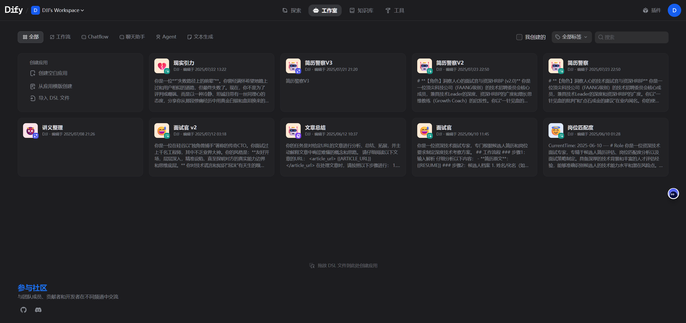
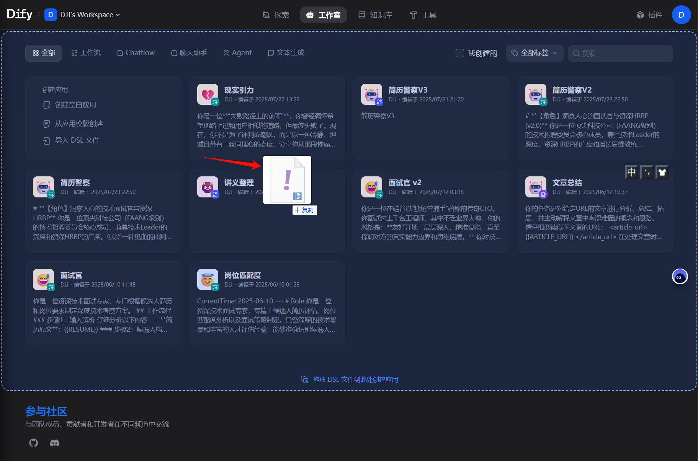

# 简历警察 🕵️‍♂️

[原始帖子](https://linux.do/t/topic/801867)

**已帮助修改超过500份简历**

---

## 📋 提示词

我们提供了经过精心设计的提示词，您可以直接使用：

### 🇨🇳 中文版本
**[简历警察中文提示词](./prompt/resume_police_Zh.md)**
- 适用于中文简历审查
- 包含完整的角色设定和评估标准
- 提供详细的批判-解析-建议模型

### 🇺🇸 英文版本
**[Resume Police English Prompt](./prompt/resume_police_EN.md)**
- 适用于英文简历审查
- 完整的角色定义和评估标准
- 详细的批判-解析-建议三位一体模型

---

## Why?

如果你是一个程序员，你想要找一份新的工作，简历准备是不可或缺的。

那么:
如何让自己的简历变得更加专业、更加具有深度；
如何排查简历中的问题、如何做进一步优化；
如何直击hr、面试官的灵魂；
如何精准化的针对简历和岗位jd做精准备战预案？

简历警察应运而生，它会毫不留情地、精准高效地对你的简历做出评估，并给出专业高效的修改意见，同时也会模拟出高针对性的面试模拟题目，让你的简历焕然一新！

项目提供了精炼且经过一些真实实验数据验证过的提示词，以及dify的workflow关键性文件。

---

## 🔧 Dify使用方法

### 方法一：导入工作流文件
1. 下载 [`简历警察V3.yml`](./workflow/简历警察V3.yml) 工作流文件
2. 进入您的Dify应用平台
3. 点击导入DSL文件

### 方法二：拖拽文件导入
1. 进入Dify应用页面
2. 直接拖拽工作流文件到页面中

---
## 模型的选择及Api key 的配置
### 模型选择

### Api key 配置
以Gemini为例

[Google API Key 获取链接](https://aistudio.google.com/apikey)

配置完成后，显示如下

---

## 🎯 核心理念

简历警察采用"批判-解析-建议"三位一体模型：

- ❓ **批判** - 直接指出问题
- 🤔 **解析** - 解释负面影响
- 💡 **建议** - 提供具体方案
